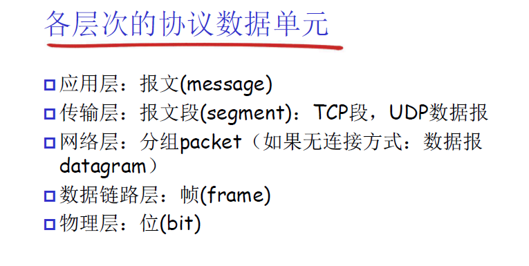
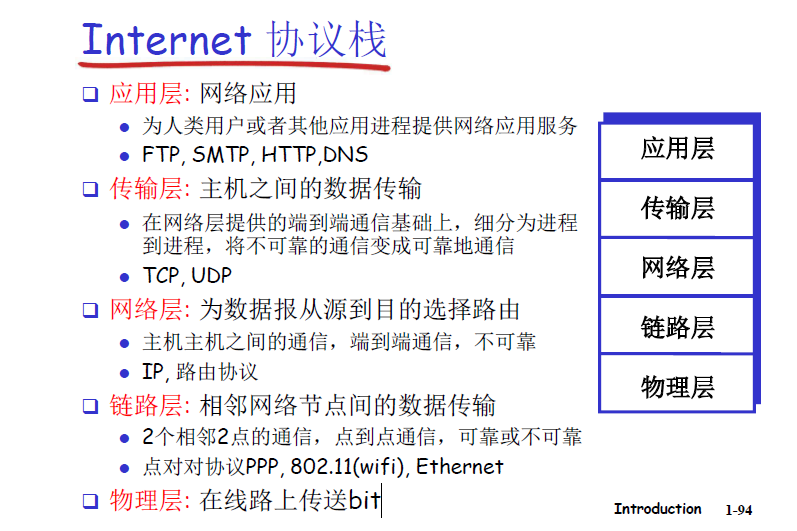

# 课程主要内容介绍
    应用层， 传输层，网络层，数据链路层

        应用层   http, ftp, ...

        传输层 tcp udp    进程到进程的传输      

        网络层 ip    端到端(E2E)        

            传统方式： IP协议  + 路由表
            SDN：   软件定义网络       数据面(交换机)+控制面(控制系统)

        数据链路层  点到点(p2p)

# 什么是internet
## 从构成的角度来说
    网络
        物理层

        链路层  相邻两点

        网络层  ip 目标主机与源主机 端到端的数据传输

        传输层  tcp/udp 

    计算机网络
        节点
            主机节点： 电脑， 手机
                图形是方形的
                
                主机节点是 源或者目标节点
            
            数据交换节点： 路由器，交换机
                图形是圆形的

                根据其工作的层次不同， 分为 中继器， 交换机， 路由器 三层

        边 链路
            网线， 光纤等

            边也分为两类
                接入网链路 主机连接到互联网的链路

                主干链路 路由器之间的链路  也分为不同的级别

        协议
            协议定义了两个或多个通信实体之间，交换报文格式和次序，以及在报文传输和接收或其他事件方面所采取的动作
            
                格式  
                    包括语法和语义
                次序
                    时序
                动作

                PDU 协议数据单元
                    在应用层称为 message

                    在传输层称为 segment

                    在网络层称为 数据包

                    在链路层称为 数据帧

            协议 分为不同的层次
                应用层协议

                传输层协议

                网络层协议

                数据链路层协议

    互联网 internet
        互联网是以 tcp ip 等一簇协议为主 支撑其工作的网络， 称为互联网

        网络的网络  inter 网际  网络 net

        联网的设备接近百亿， 网络接近百万

## 从服务的角度来说
    使用通信设施进行通信的分布式应用
        web voip email ...

    通信基础设施为app提供编程接口（通信服务）
        将发送和接收数据的app与互联网连接起来
        为app应用提供服务选择，类似于邮政服务， 无连接不可靠服务（tcp），有连接可靠服务(udp)

## 网络结构 三个子系统
    网络边缘
        主机
        主机上的应用程序（客户端和服务端）

    网络核心
        互联着的路由器，网络的网络

    接入网，物理媒体
        把网络边缘 接入到 网络核心 有线或者无线通信链路

    边缘， 核心， 接入

        边缘 通过 接入 接入到 核心

        网络核心的作用是数据交换， 让边缘设备可以彼此之间交换设备

## 1.2 网络边缘
    端系统（主机）
        运行应用程序
        如web, 
        在网络边缘

    客户端、服务器模式
        客户端向服务器请求，接受服务
        如web浏览器， email

    对等模式 peer to peer
        很少甚至没有专门的服务器

    网络边缘-采用网络基础设施的面向连接服务
        握手 在数据传输之前，做好准备
            两个通信主机之间为连接建立状态

            tcp:
                可靠的， 保序的  不重不错，不乱不丢

                流量控制
                    发送方不会淹没接收方

                拥塞控制
                    当网络拥塞时，发送方降低速率

            

    网络边缘-采用网络基础设施的无连接服务

## 1.3 网络核心
    网络核心： 路由器的网状网络

    电路交换: 被传统的电话网络采用
        时分， 频分， 波分， 码分复用

    分组交换: 以分组为单位存储，转发， 被计算机网络使用， 支持的主机更多
        网络带宽资源不再分为一个一个片，传输时使用全部带宽
        主机之间传输的数据被分为一个个分组

            存储转发时延

            排队时延

        划分时间片不是固定的， 统计多路复用-一种特殊的时分复用

        又可细分为 数据报网络， 虚电路网络

            数据报网络： 网络层没有连接
                分组的目标地址决定下一跳地址
                在不同的阶段，路由可以改变
                internet使用这种

            虚电路网络： 网络层有连接
                建立虚电路，使用信令来建立虚电路
                两个主机在交换数据之前，需要建立连接，按照虚电路号来标识路径
                在呼叫建立时决定路径，路由器维持每个呼叫的状态信息
                x.25  atm

    网络核心的关键功能：
        转发  路由

        路由时端到端的概念   全局的

        转发是相邻两个主机之间的概念  局部的 

## 1.4 接入网和物理媒体
    如何把 网络边缘 接入到网络核心     --- 使用接入网

    住宅接入网
        modem， dsl, 线缆网络， 

    单位接入网

    无线接入网
        无线lans 
            覆盖建筑物内部
            802.11b/g

        广域无线接入
            由电信运营商提供， 10Km

物理媒体
    bit 在发送接收间传播

    物理链路： 连接每个发送-接收对之间的物理媒体

        导引型媒体
            信号沿着固体媒介被导引， 同轴电缆，光纤， 双绞线

        非导引型媒体
            开放空间中传输电磁波

## 1.5 internet结构和ISP
    端系统通过接入ISPs(internet service providers)连接到互联网

    很多个接入ISP都连接到全局ISP
        客户isp和提供这isp有经济合约

        如果全局ISP可行， 那会有多个全局ISP， 不同全局ISP之间也会互联

            ISP分为不同级别
                tier1 isp

                tier2 isp  region isp

                local isp

                access isp

## 1.6 分组时延，丢失和吞吐量
    四种分组时延：
        节点处理时延

        排队时延

        传输时延

        传播时延

    
    icmp 协议 互联网控制协议

        TTL  time to live 每路过一个路由器，减一， 

        RTT 往返延时  round trip time

## 1.7 协议层次与服务模型

    分层    计算机网络采取的这种方法

    模块化

    服务 
        低层实体向上层实体提供他们之间的通信能力，通过原语来操作，垂直

        SAP 服务访问点： 服务提供者向用户提供服务的访问点 层间界面的服务访问点
            传输层的SAP： 端口
                socket 套接字

            网络层  ip地址

         原语： 提供服务的形式， 低层向高层提供服务都是通过服务访问原语来进行交互的

        服务的类型：
            面向连接的服务
                建立连接-通信-关闭连接

            无连接的服务
    协议 
        对等层实体之间在相互通信过程中遵守的规则的集合-水平
        协议的实现 借助于下层所提供的服务才能实现  协议实现的目的是为了向上层提供更好的服务

        水平协议，垂直服务

    数据单元（DU）
        SAP： service access point
        IDU: Interface data unit
        SDU: service data unit
        PDU: protocol data unit
        ICI: interface control information

        ICI + SDU  = IDU

        上层传来的数据，对于本层来说，是SDU， 本层的header + SDU， 是本层的PDU
            header + SDU = PDU

        每一层的PDU，都有特定的称呼
            应用层， PDU称为 应用报文 message
            传输层， PDU称为 报文段， TCP段， udp数据报
            网络层， PDU称为 分组， 如果网络层以无连接方式工作，又称为数据报
            链路层， PDU称为 帧

internet 协议分层
 

    表示层
        允许应用解释传输的数据， 加密，压缩，机器相关的转换表示

    会话层
        数据交换的同步，检查点，恢复

## 1.8 历史
    1960 年之前，线路交换网络

    1969年 第一个 ARPAnet 节点开始工作， 共建立4个节点

    1972年 ARPAnet 公众演示， 失败， 此时有15个节点

    1972-1980年 专用网络和网络互联

    1980-1990年 体系结构变化，网络数量激增，应用丰富

        1982年，smtp email 协议定义

        1983年， tcp/ip 部署    
                NCP --->  tcp/ip       停机升级

            dns  域名解析

            ftp  文件传输

            TCP拥塞控制

    
    1990-2000年， 商业化，web, 新应用
            1994年 netscape

    2000-之后
        用户规模增大，接入方式丰富（移动），商业应用多样

## 1.9 总结

