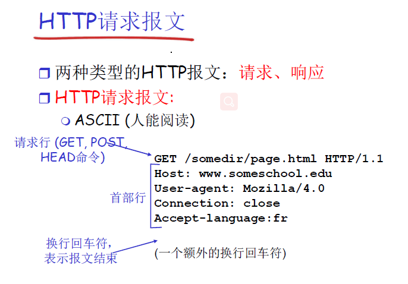
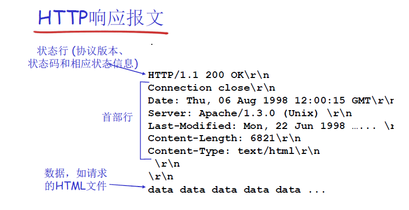
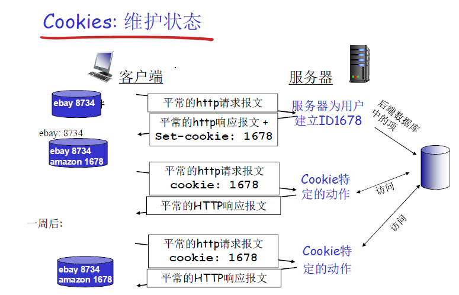
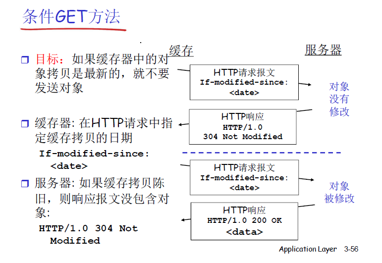

# 2.1 应用层协议原理
    web
    ftp
    email smtp, pop3,imap

    dns
    p2p
    cdn

    ssl

网络应用的体系结构
    客户端、服务器模式
    对等模式P2P
    混合体

分布式进程通信需要解决的问题
    源端口号，源主机，目标端口号，目标主机

    tcp socket
        传输数据前，需要先建立连接，使用 socket来标识一个会话关系
        使用 socket 来标识一个 （源端口号，源主机，目标端口号，目标主机） 唯一四元组， socket即这个四元组在本地（本地主机）意义的标识

    udp socket
        无需建立连接
        无连接服务udp, socket标识一个具有本地意义的二元组(源端口号，源主机)

        发送报文时，需要指定对方的ip地址和udp端口

    理解套接字
        进程向套接字发送报文或者从套接字接收报文

        套接字 --- 门户

应用层协议
    定义了运行在不同端系统上的应用程序如何相互交换报文
        报文的类型
        语法
        字段的语义

## 2.2 web和http
    web页

    对象

    URL

    http
        超文本传输协议

        客户端、服务器模式

        使用tcp

        http是无状态的

        非持久http, 持久http(多个对象可以在一个tcp连接上传输，一次传输完成后，不会马上关闭连接)
            持久http又分为非流水方式，流水方式两种
                非流水方式，客户端只能在收到一个响应后才能发出新的请求
                流水方式，可以连续发送多个请求，不需要等前一个请求返回

        两种类型的http报文， 请求， 响应
            http报文是ascii型式的， 人可以阅读

            请求报文
                

            响应报文
                

        用户-服务器状态 cookies
            http是无状态的

            但可以在 http报文头部加入cookie来携带状态信息
                客户端在第一次访问服务端之后，服务端会给该客户端分配一个 cookie
                    

    web缓存（代理服务器）
        减少访问源服务器的时间

        但缓存可能和源服务器的文件不一致，所以需要代理服务器去源服务器检查，其本地文件和源服务器文件是否一致
            
            

2.3 FTP
    