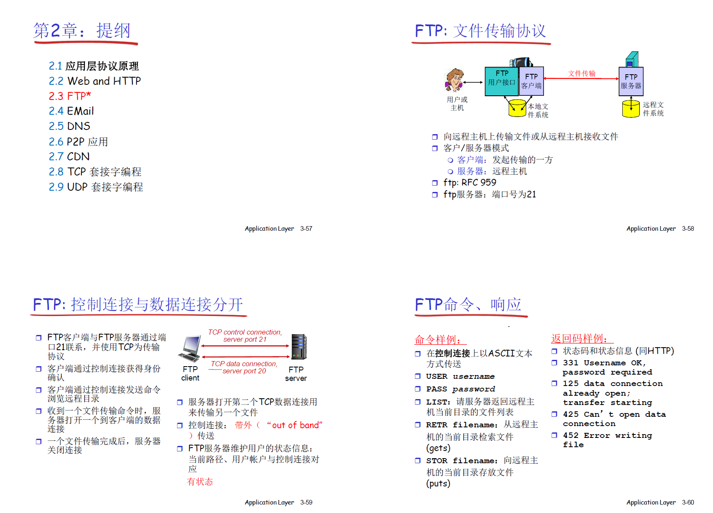

# 2.1 应用层协议原理
    web
    ftp
    email smtp, pop3,imap

    dns
    p2p
    cdn

    ssl

网络应用的体系结构
    客户端、服务器模式
    对等模式P2P
    混合体

分布式进程通信需要解决的问题
    源端口号，源主机，目标端口号，目标主机

    tcp socket
        传输数据前，需要先建立连接，使用 socket来标识一个会话关系
        使用 socket 来标识一个 （源端口号，源主机，目标端口号，目标主机） 唯一四元组， socket即这个四元组在本地（本地主机）意义的标识

    udp socket
        无需建立连接
        无连接服务udp, socket标识一个具有本地意义的二元组(源端口号，源主机)

        发送报文时，需要指定对方的ip地址和udp端口

    理解套接字
        进程向套接字发送报文或者从套接字接收报文

        套接字 --- 门户

应用层协议
    定义了运行在不同端系统上的应用程序如何相互交换报文
        报文的类型
        语法
        字段的语义

## 2.2 web和http
    web页

    对象

    URL

    http
        超文本传输协议

        客户端、服务器模式

        使用tcp

        http是无状态的

        非持久http, 持久http(多个对象可以在一个tcp连接上传输，一次传输完成后，不会马上关闭连接)
            持久http又分为非流水方式，流水方式两种
                非流水方式，客户端只能在收到一个响应后才能发出新的请求
                流水方式，可以连续发送多个请求，不需要等前一个请求返回

        两种类型的http报文， 请求， 响应
            http报文是ascii型式的， 人可以阅读

            请求报文
                

            响应报文
                

        用户-服务器状态 cookies
            http是无状态的

            但可以在 http报文头部加入cookie来携带状态信息
                客户端在第一次访问服务端之后，服务端会给该客户端分配一个 cookie
                    

    web缓存（代理服务器）
        减少访问源服务器的时间

        但缓存可能和源服务器的文件不一致，所以需要代理服务器去源服务器检查，其本地文件和源服务器文件是否一致
            
            

## 2.3 FTP
    

        ftp协议， 客户端和服务端之间保留状态信息
            控制连接发送命令
            数据连接发送要传输的文件

## 2.4 email
    三个部分：用户代理，邮件服务器，简单邮件传输协议（SMTP）

        用户代理， 就是邮件阅读器，邮件客户端，可以用于编写，阅读，编辑邮件，比如 outlook, foxmail
            输入和输出邮件是保存在服务器上的，用户代理从服务器拿到数据来展示

        邮件服务器
            发送队列， 接手队列
            一个邮箱地址，有发送，接收队列

            邮件服务器之间使用SMTP协议发送数据

        简单邮件传输协议

    邮件访问协议
        POP， IMAP， http

## 2.5 DNS 域名解析
    域名到ip地址的转换

        如何命名主机
            层次化的命名

            分布式的数据库维护和响应名字查询

            增加或者删除一个域，需要在域名系统中做哪些工作

            运行在udp之上端口号为53的应用服务

    DNS名字空间
        DNS域名结构
            internet被划分为几百个顶级域
                通用的，.com, .edu, .gov, .mil, .net, .org

                国家的， .cn, .us, .nl, .jp

            每个域下可划分为若干个子域
                域与物理网络无关
                    域遵从组织界限，而不是物理网络
                        一个域的主机可以不在一个网络
                        一个网络的主机可以属于不同的域名

                        域的划分是逻辑的， 不是物理的

            解析问题
                一个名字服务的问题：
                    可靠性问题，单点故障
                    扩展性问题，通信容量
                    维护问题，远距离的集中式数据库

                区域
                    区域的划分由区域管理者定
                    将DNS名字空间划分为互不相交的区域
                    名字服务，每个区域都有一个名字服务，维护着他所管辖区域的权威信息，名字服务器允许放在区域之外

                    名字空间划分为若干区域，zone

                权威DNS服务器，组织机构的DNS服务器，提供组织机构服务器可访问主机与IP之间的映射

        TLD服务器，顶级域（TLD）服务器
            负责顶级域名和所有国家级顶级域名

        

        资源记录（resource record）
            作用：维护域名与ip地址的映射关系
            位置：name server 的分布式数据库中

            格式：domain_name, ttl, class, value, type

        本地名字服务器
            每个ISP都有一个本地DNS服务器，当一个主机发起一个DNS查询，查询先被送到本地的DNS服务器，起着代理服务的作用，将DNS查询转发到其他层次结构中

## 2.6 P2P应用

## 2.7 视频流化服务和CDN
    视频流量占网络中总流量的大多数

    多媒体-视频
        视频：固定速度显示的图像序列

        网络视频特点： 高码率，可以被压缩

        数字化图像：像素的阵列

        CBR， VBR
            固定码率编码 CBR
            视频编码速率随时间的变化而变化 VBR

    

    多媒体流化服务 DASH
        m3u8

        dash
            dynamic adaptive streaming over http

            服务器， 将视频文件切分成多份， 没份独立存储，编码于不同码率，告示文件(m3u8)提供不同块的url

            客户端， 先获取告示文件， 然后随着播放时间依次请求没份视频，

    CDN content distribution network
        内容分发网络

## 2.8 TCP套接字编程
    

