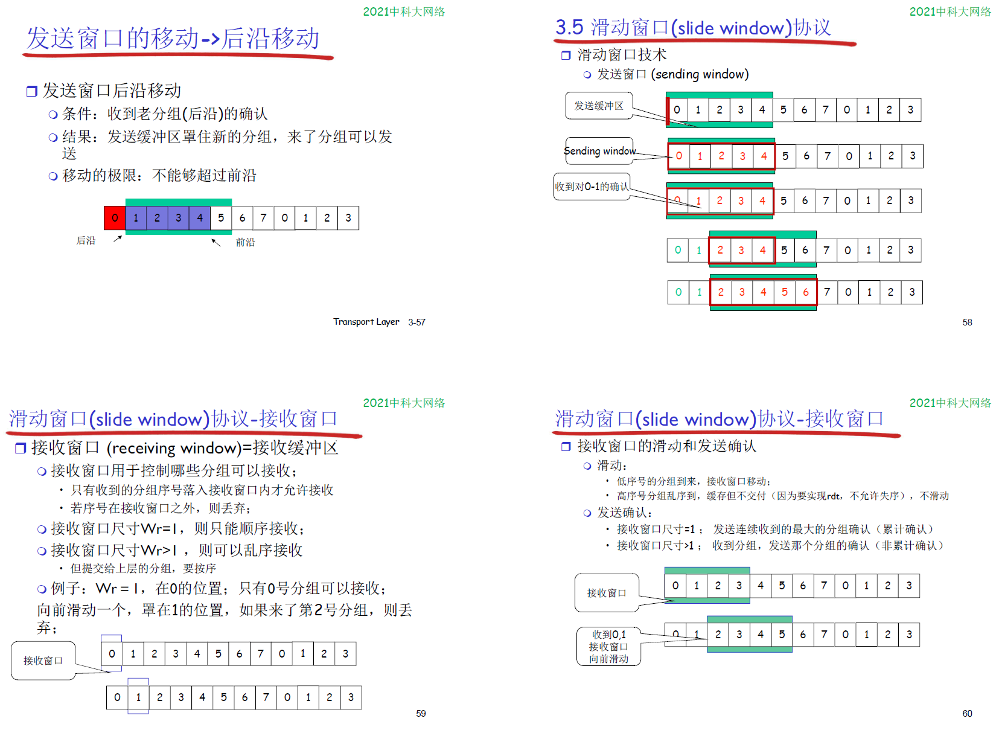
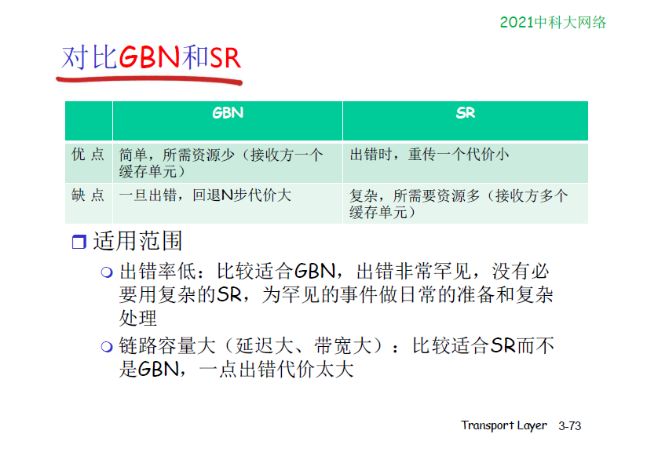

## 3.1 概述与传输层服务
    理解传输层的工作原理
        多路复用与解复用
        可靠数据传输
        流量控制
        拥塞控制

        传输层协议     tcp udp

    传输服务与协议
        运行在不同主机上的应用进程提供逻辑通信
        传输协议运行在端系统

    网络层， 传输层
        网络层服务： 主机之间的逻辑通信

        传输层服务： 进程之间的逻辑通信
            依赖于网络层的服务， 延时，带宽
            并对网络层的服务进行增强，处理网络层服务的一些问题（数据丢失，顺序混乱，没有加密）

        

## 3.2 多路复用与解复用
        

        TCP套接字 --- 四元组      源IP ， 目标IP， 源端口， 目标端口
        udp套接字 -- 二元组       源IP + 源端口
            套接字 -- 类似于文件描述符， 使用套接字来唯一定位四元组或者二元组， 只要四元组或者二元组中任意一个参数不一样，则定位到不同 的套接字

## 3.3 无连接传输UDP
        用户数据报协议 UDP
            相比于网络层，增加了多路复用与解复用服务，除此之外没有像tcp那样增加其他保证数据传输等功能
            

            

            udp头部固定8个字节长度，TCP头部最少20个字节
                网络层协议IP， IPv4的头部结构长度为20字节，若含有可变长的选项部分，最多60字节

## 3.4 可靠数据传输（rdt）的原理 
    1 在可靠信道上的可靠数据传输

    2 具有比特差错的信道
        用校验和来检查比特差错

        使用ACK、NAK 标志是否正确接收

        但是ACK， NACK也可能出错，发送方不知道该如何处理了， 引入 序号 机制
            处理重复，发送方在每个分组加入序号，如果ACK，NAK出错，发送方重发，接收方丢弃重复分组

        rdt2.1 
            发送方：
            在分组中加入序号
            一次只发送一个未经确认的分组
            必须检测ack/nak是否出错

            接收方：
            必须检测接收的分组是否重复
            接收方并不知道发送方是否正确接收了 ack nak

        无NAK的协议
            只使用 ack, ack编号
                接收方对最后正确接收的分组发ack, 以替代nak
                接收方必须显式的包含被正确接收的分组序号

            用前一个分组的ack代替当前分组的nak

    3 具有比特差错和分组丢失的信道  rdt3.0
        假设： 下层信道可能会丢失分组， ack或者数据

        现有机制： 校验和， 序列号 ， ack， 重传
            还不足以处理这种情况

        发送方等待ack一段合理的时间，超出之后就重传
            问题：如果分组只是被延迟了，重传会导致数据重复，接收方需要明确以及被正确接收的序列号

            需要一个倒计时定时器

        性能：
            在链路容量比较大的时候，一次发一个PDU，不能够充分利用链路的性能，主要是因为其工作方式， 停-等操作

            可以使用流水线提高链路利用率，也就是不需要等当前发出去的分组被确认，就可以发下面的分组
                流水线：允许发送方在未得到对方确认的情况下一次发送多个分组
                    需要增加序号的范围，用多个bit表示分组的序号，在发送方，接收方，需要有缓冲区
                        发送方缓冲区：未得到确认，可能需要重传
                        接收方缓冲区：上层用户取用数据的速率不等于收到的速率，接收到的数据可能乱序，排序交付

    4 通用 滑动窗口协议
        发送缓冲区
            内存中的一个区域，落入缓冲区的分组可以发送

            用于存放已经发送，但没有得到确认的分组

            需要时重发

        发送缓冲区的大小  一次最多可以发送多少个未经确认的分组
            停等协议 窗口大小 = 1

            流水线协议 窗口 > 1, 合理的值，不能很大， 链路利用率不能超过100%

        发送缓冲区的分组：
            未发送的： 落入发送缓冲区的分组，可以连续发送出去

            已经发送出去的，等待对方确认的分组，发送缓冲区的分组只有得到确认的才能删除

            滑动窗口(slide window)协议
                发送窗口： 发送缓冲区内容的一个范围， 那些已经发送，但还没有确认分组的序号构成的空间

                发送窗口的最大值 <= 发送缓冲区的值

            
            

                发送窗口 SW = 1, 接收窗口 RW = 1, 即为 停等协议 s-w
                SW > 1, RW = 1         为 GBN协议

                SW > 1, RW > 1,        为SR协议

                发送窗口大小
                    如果序号用n个bit来标识， GBN协议窗口最大为 2^n - 1 ,   SR协议窗口最大为 2^(n-1)

            

            

            

## 3.5 面向连接的传输 tcp
    概述
    

    TCP报文结构
    

