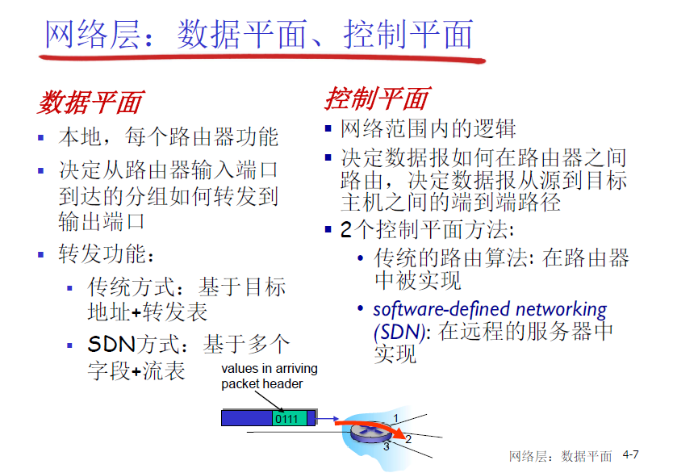

## 4.1 导论

    网络层-数据平面

网络层服务
    在发送主机与接收主机之间传输数据
    网络层协议存在于每一个主机和路由器

    路由器检查每一个经过它的ip数据报头部

    网络层功能：
        路由
            使用路由算法来决定分组从发送主机到目标主机的路径， 路由选择算法， 路由算则协议

        转发
            将分组从路由器的输入接口转发到合适的输出接口

            旅行的类比： 转发相当于通过单个路口， 路由是从源到目的的路径规划过程

    数据平面， 控制平面
        

        

    网络提供的服务模型
        对于单个数据报的服务

        对于数据报流的服务
        

        对于有些网络，源到目标主机的路径中的其他主机都有连接（维护了端到端的状态， 虚电路）， 这种情况是有连接的网络，而对于Internet的TCP/ip网络, 是面向连接的，只有源和目标这两端的主机有位置连接状态的功能
        

        网络层与传输层连接服务的区别
            网络层： 在两个主机之间，涉及到路径上的一些路由器

            传输层：在两个进程之间，可能只体现在端系统上（TCP连接）

        
        internet的网络层，是尽力而为的服务模型， 对带宽，是否丢失，是否保序，延迟量，拥塞控制，都不保证，这些服务在传输层提供了

## 4.2 路由器组成

    路由
        运行路由选择算法，生成路由表
    转发
        从输入到输出链路交换数据报-根据路由表进行分组的转发

输入端口功能：
    

    基于目标的转发
        最长前缀匹配

    通用转发（SDN）

交换结构
    memory， bus, crossbar
    

输出端口

    调度规则： FIFO， 优先权调度， 随机， WFQ

## 4.3 IP 协议

    概括来讲，MTU是以太网数据链路层中约定的数据载荷部分最大长度，数据不超过它时就无需分片。

    MSS是传输层的概念，由于数据往往很大，会超出MTU，所以在网络层中学习过IP分片的知识，将很大的数据载荷分割为多个分片发送出去。

    TCP为了IP层不用分片主动将数据包切割为MSS大小。

    一个等式可见他两关系匪浅： MSS = MTU - IP header头大小 - TCP 头大小

    
        目标主机重组分片

IP地址

    ip地址，和网口关联，网络层的关联，            链路层和网口的关联是mac地址

    IP地址分类
        A类

        B类

        C类

        D类

    特殊IP地址

    

    

    如何获取IP地址
        

        IP地址，子网掩码，默认网关default gateway, local dns

    层次编址， 路由聚集

    NAT， 网络地址转换
    

    

    ipv6 
    

    

## 4.4 通用转发与SDN
    

    

    

    

    
        模式： 流表来定义，分组头部信息和流表中的每一项来匹配

        行动： 对于匹配上的分组，可以做一系列动作，可以丢弃分组，转发，修改。。。

        转发表： 基于目标的转发

        流表： 通用转发， SDN

        通过控制平面算出转发表（垂直，每个路由器都有控制面）和流表（水平，SDN）

        

