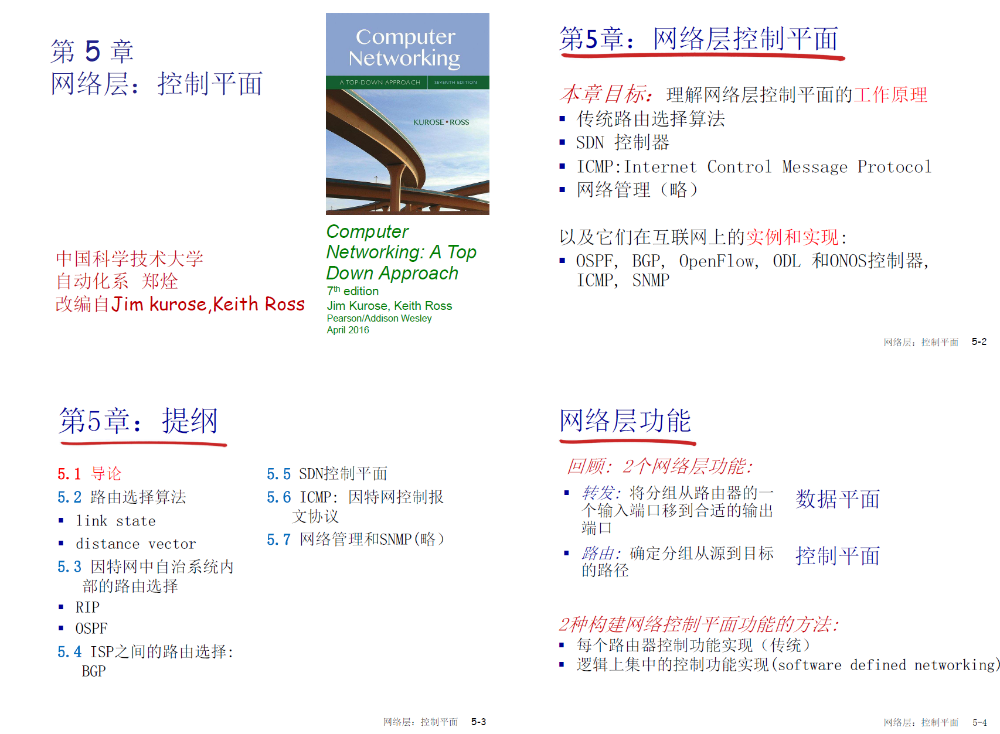
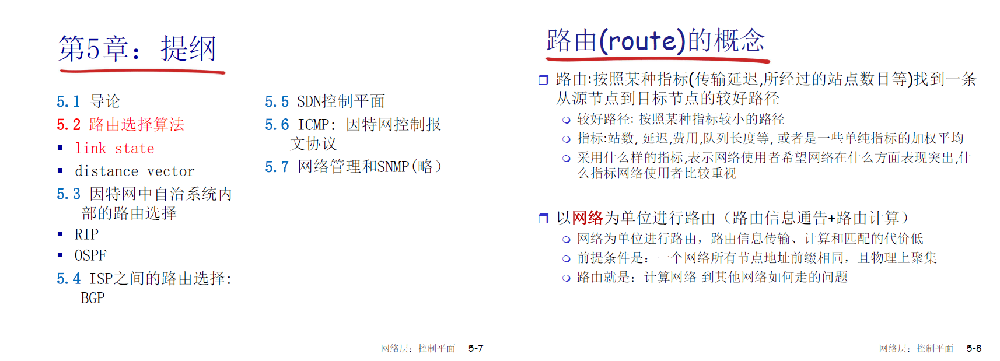
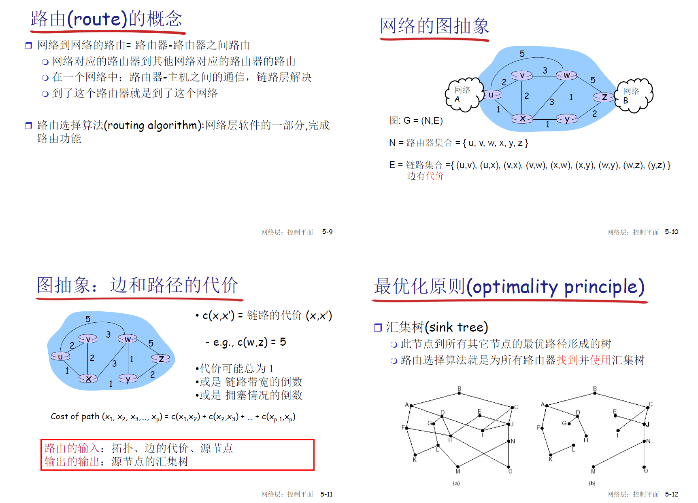
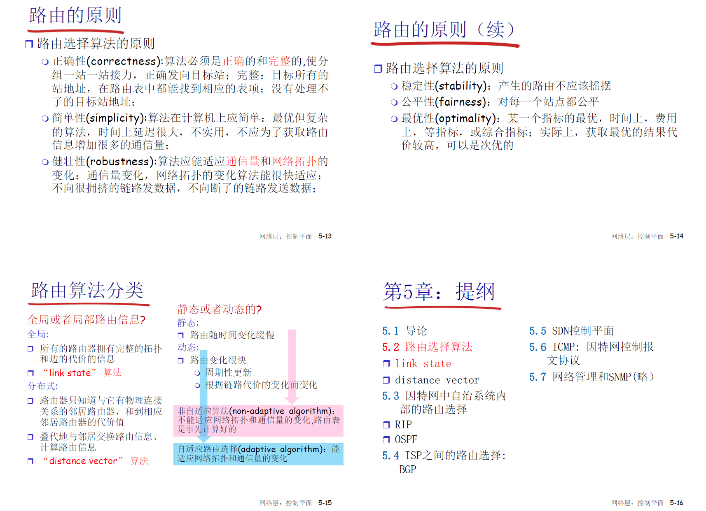
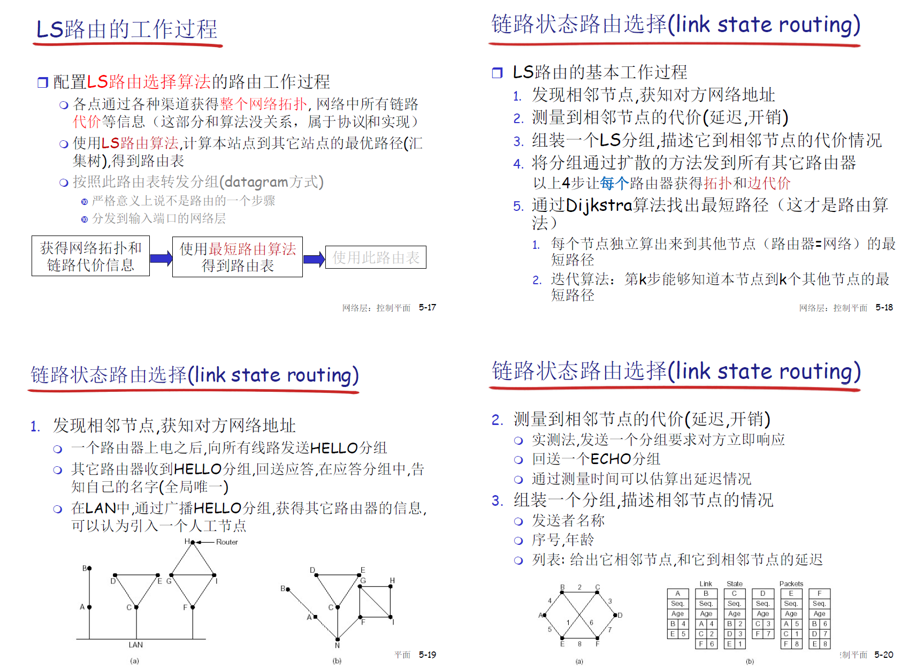

## 5.1 导论

    路由选择算法

    SDN控制平面

    ICMP 互联网控制报文协议

    网络管理和SNMP

## 5.2 路由选择算法
    link state

    distance vector

    路由： 确定分组从源到目标的路径  控制平面的工作
    转发：将分组从路由器的一个输入端口移动到合适的输出端口   数据平面的工作，依赖于控制平面生成的路由表来完成

    

    

    

    路由算法分类
        全局或者局部信息

            所有的路由器拥有完整的拓扑和边的代价的信息， link state 算法

            分布式  路由器只知道与他有物理连接关系的邻居路由器与到各邻居路由器的代价

        静态或动态
            静态： 路由随时间变化缓慢

            动态： 周期性更新或者根据链路代价的变化而变化

        是否为自适应的

    link state算法， 就是dijkstra算法
        

5.2-22

