# 6 链路层

    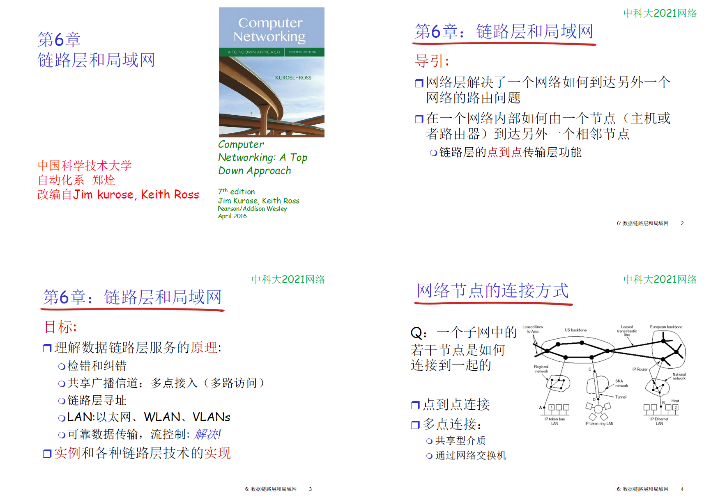

    网络层解决一个网络如何到达另一个网络的路由问题

    在一个网络内部，如何由一个节点到达另一个相邻节点，由链路层的 点到点 传输实现

    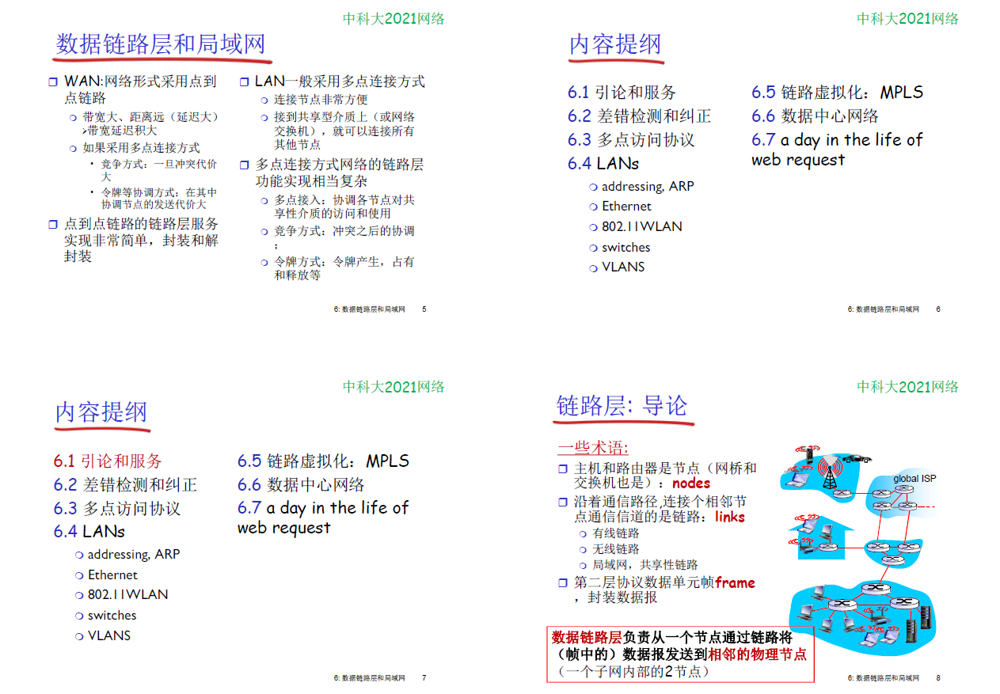
        WAN 网络形式采用 点到点 的链路

    网络层是端到端(主机到主机)，链路层是节点到节点(节点可能是主机，也可能是路由器)，传输层是进程到进程的

    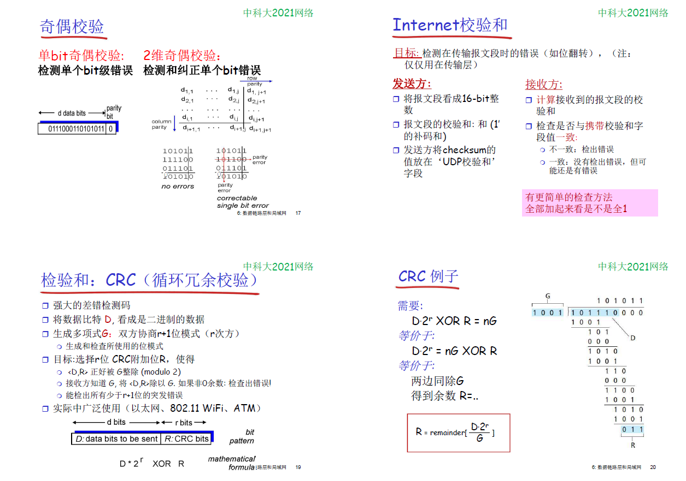

## 多路访问协议

    两种类型的链路
        点对点
            拨号访问的ppp,以太网交换机与主机之间的通信

        广播   
            传统以太网，hfc上行链路，802.11无线局域网

    
    多路访问协议（介质访问控制协议， MAC）

    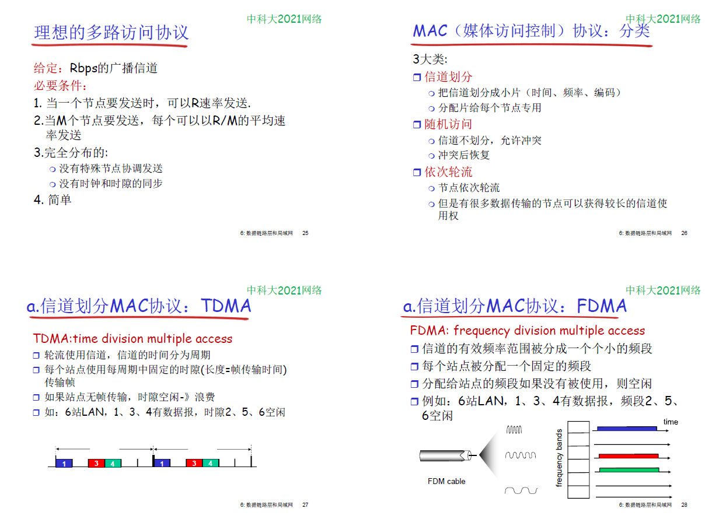
    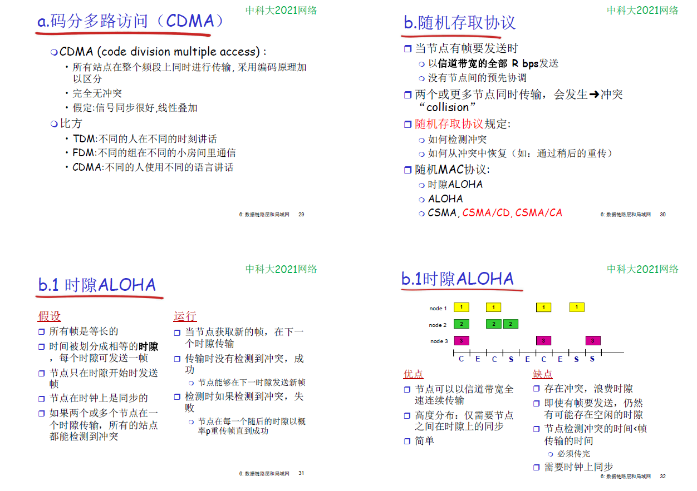
    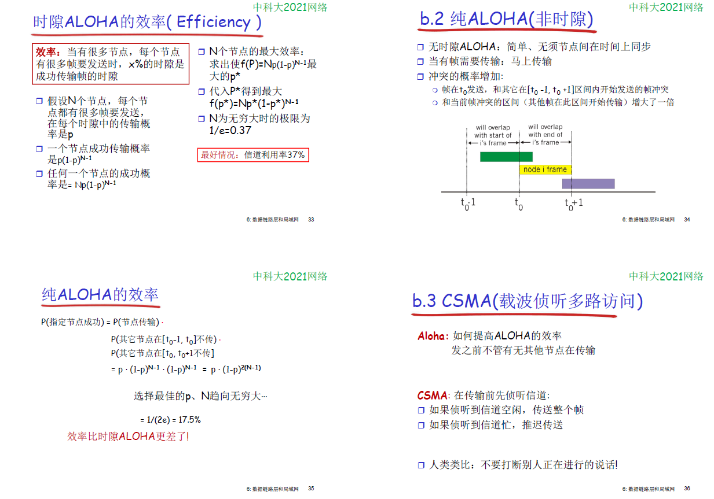
    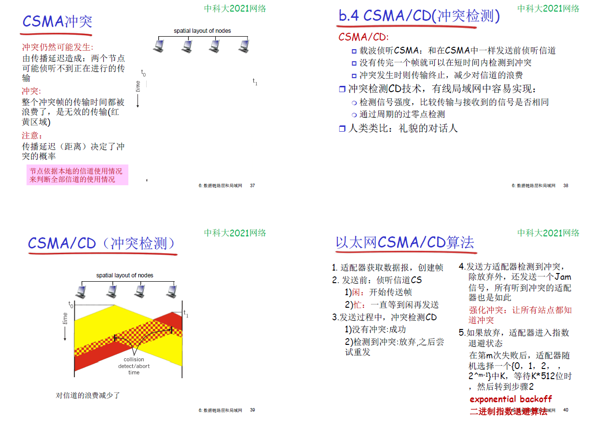

    CSMA       carrier sense multiple access

    在WLAN中，无法做CD（冲突检测）

    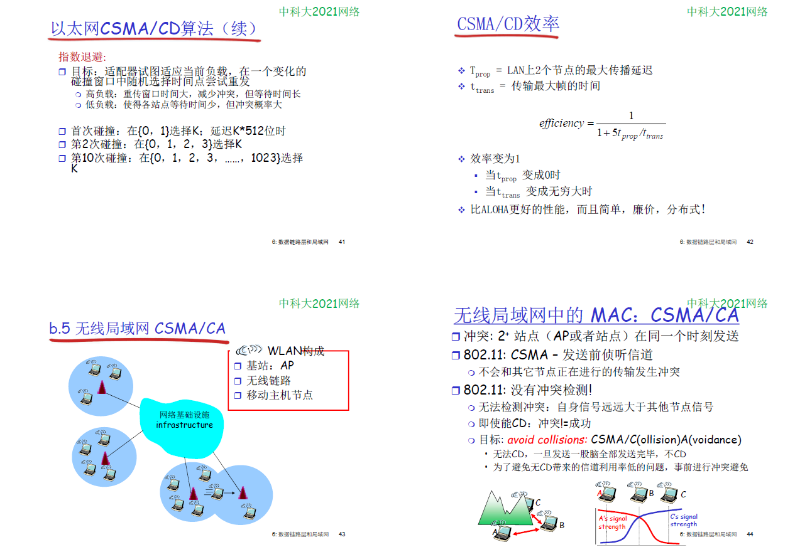
    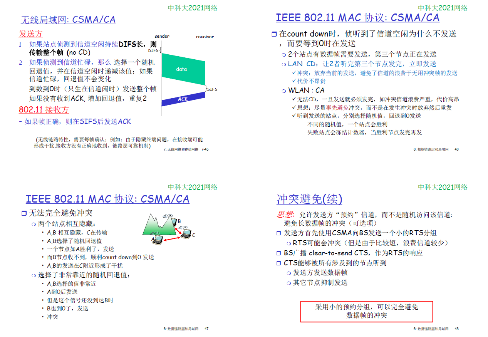
        在无线网中，由于无线信道不可靠，在链路层也需要有ACK，

    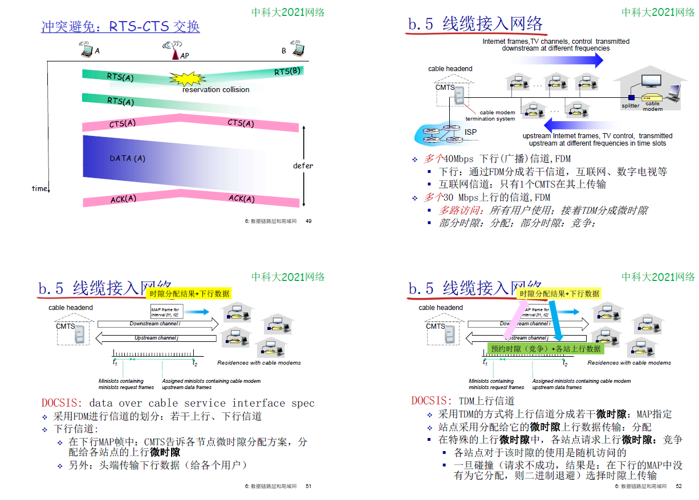

    

## 6.4 LANs
    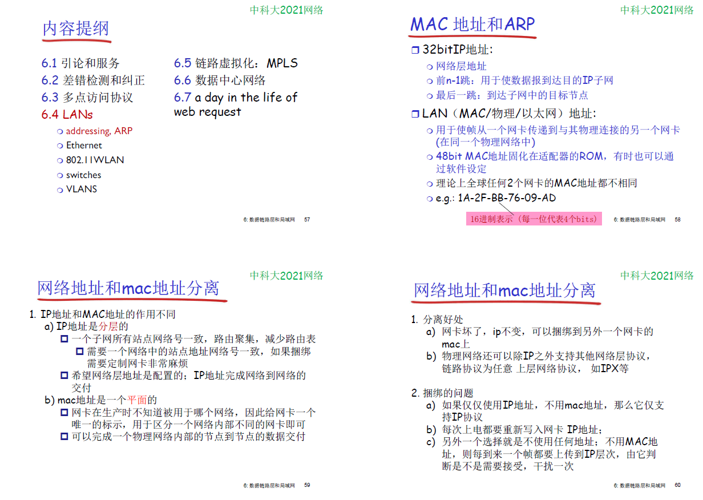

