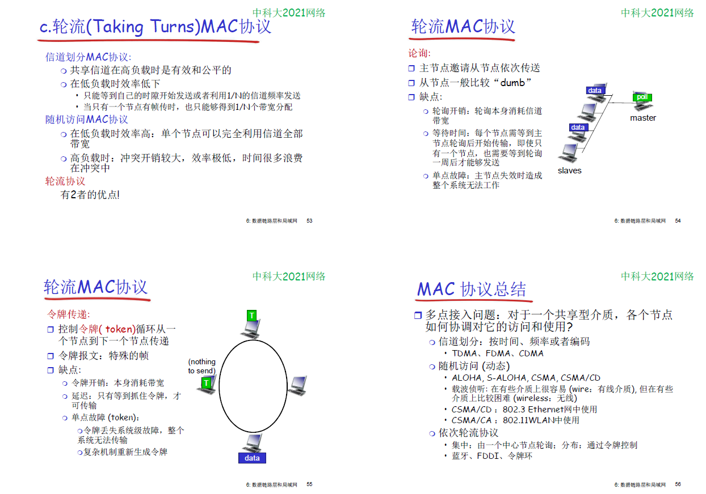
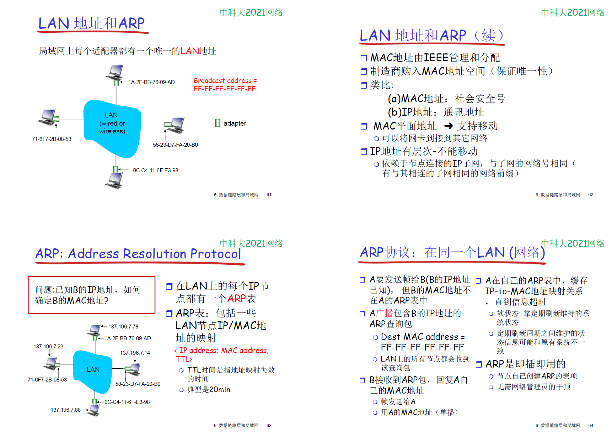
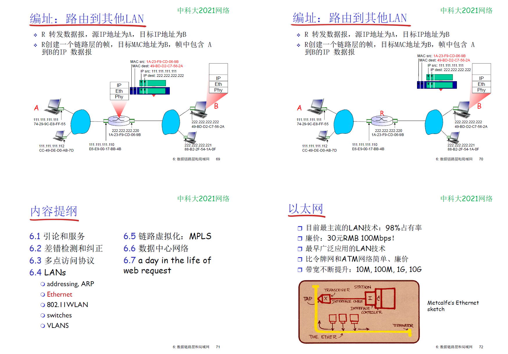
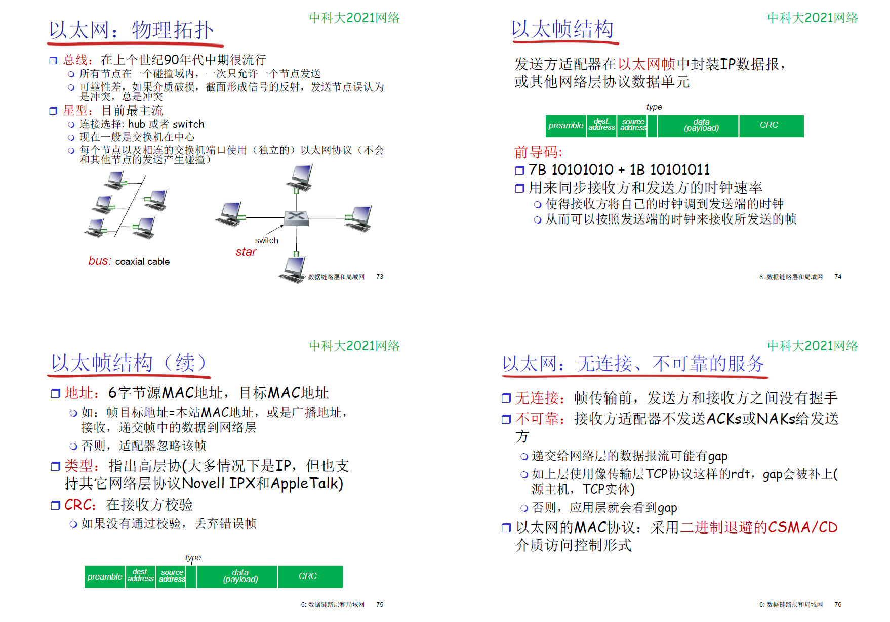
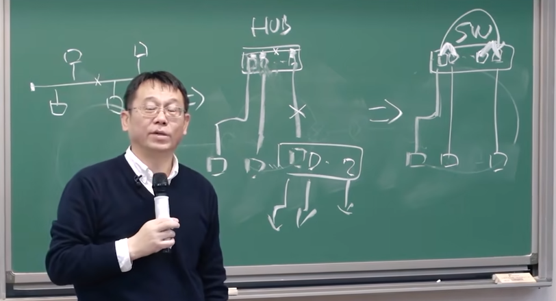
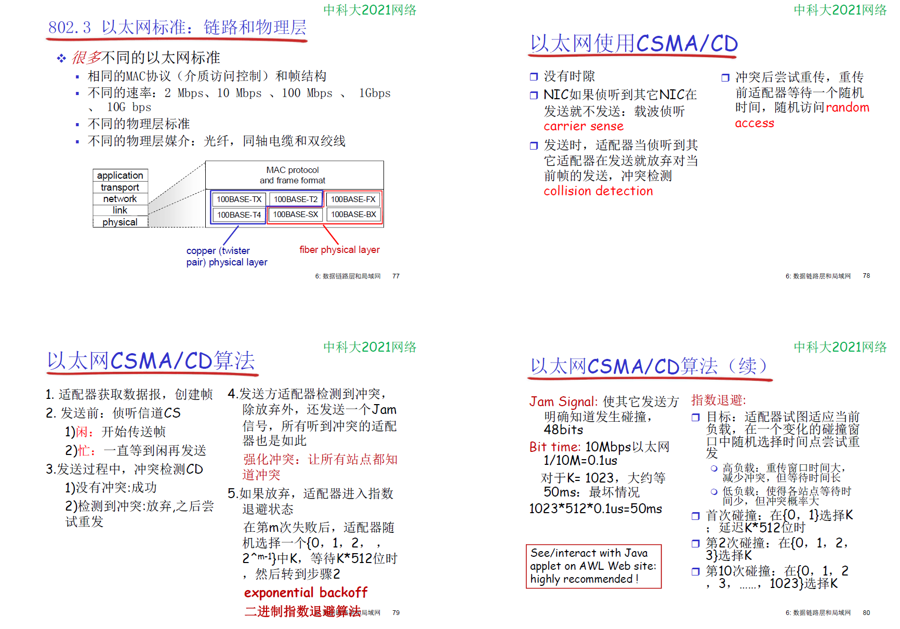
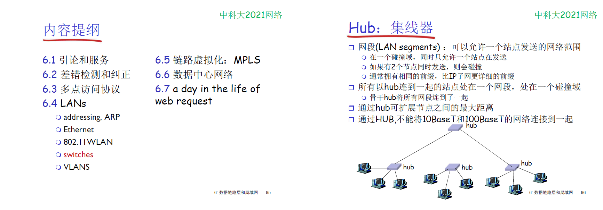
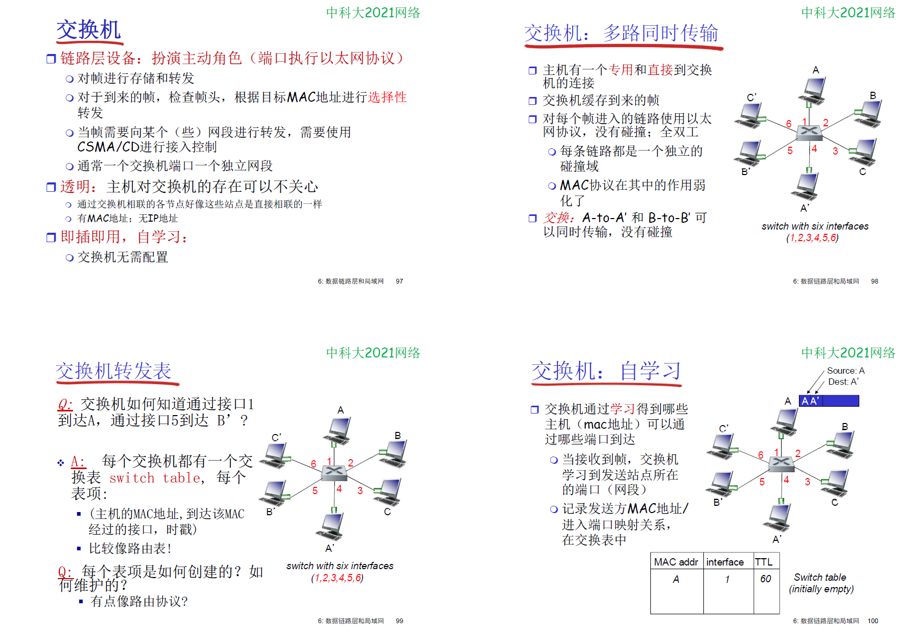
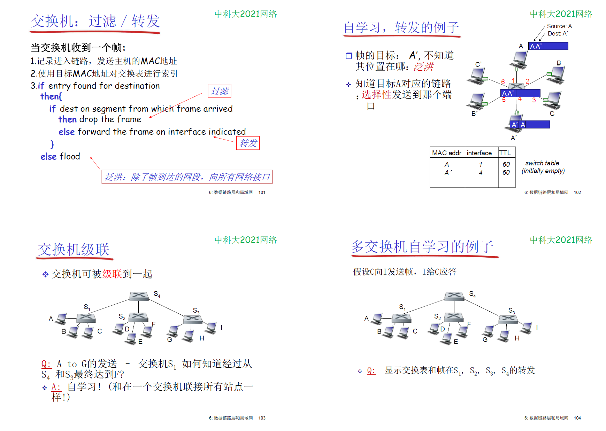
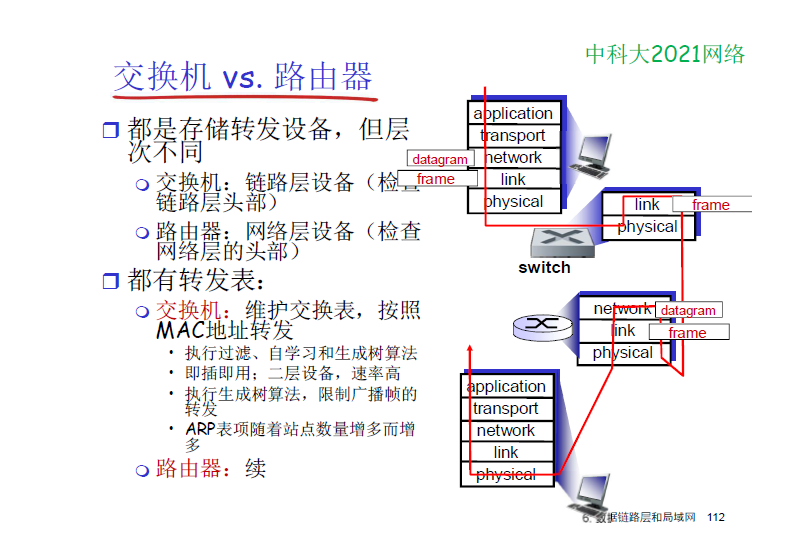

# 6 链路层

    

    网络层解决一个网络如何到达另一个网络的路由问题

    在一个网络内部，如何由一个节点到达另一个相邻节点，由链路层的 点到点 传输实现

    
        WAN 网络形式采用 点到点 的链路

    网络层是端到端(主机到主机)，链路层是节点到节点(节点可能是主机，也可能是路由器)，传输层是进程到进程的

    

## 多路访问协议

    两种类型的链路
        点对点
            拨号访问的ppp,以太网交换机与主机之间的通信

        广播   
            传统以太网，hfc上行链路，802.11无线局域网

    
    多路访问协议（介质访问控制协议， MAC）

    
    
    
    

    CSMA       carrier sense multiple access

    在WLAN中，无法做CD（冲突检测）

    
    
        在无线网中，由于无线信道不可靠，在链路层也需要有ACK，

    

    

## 6.4 LANs
    

    arp协议
        

    以太网
        

        
            目前使用 星型 的物理拓扑， 连接使用 Hub或者 switch
                hub 从一个端口收，往所有端口发， 相当于在hub中有一个总线，（物理上是星型， 逻辑上是总线型）

                switch 交换机， 从一个端口收， 往另一个端口发， 此外，其他的端口还可以同时收发其他数据
                    

        

    交换机
    

    

        交换表： mac地址-网卡端口

    

    

    

## 6.6 数据中心网络

## 6.7 a day in the life of web request

