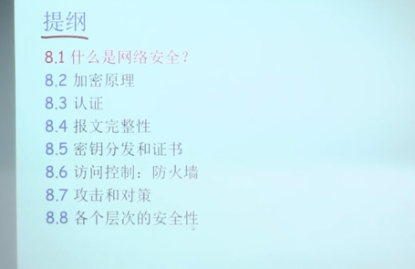

# 概述

    私密性， 可认证，报文的完整性， 密钥分发

    

# 8.1 什么是网络安全

    私密性  我发的数据的真实内容需要不被其他人看到
    可认证  能够确认发送方的身份
    完整性  发送方，接收方需要确认报文在传输过程中或者事后没有被修改
    访问控制与服务可用性  服务可以接入以及对用户可用

    

# 8.2 加密原理

    

    对称加密， 非对称加密
        对称加密中， key分发是个问题， 所以一般用非对称加密的方式交换对称加密的密钥(key), 

    

    

    
        
        DES data encryption standard

        AES advanced encryption standard

    块加密
    

    

    公开密钥密码学  非对称加密  公钥，私钥
    

