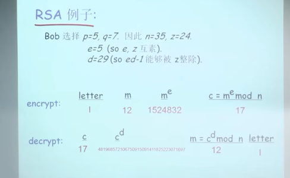

# 概述

    私密性， 可认证，报文的完整性， 密钥分发

    

# 8.1 什么是网络安全

    私密性  我发的数据的真实内容需要不被其他人看到
    可认证  能够确认发送方的身份
    完整性  发送方，接收方需要确认报文在传输过程中或者事后没有被修改
    访问控制与服务可用性  服务可以接入以及对用户可用

    

# 8.2 加密原理

    

    对称加密， 非对称加密
        对称加密中， key分发是个问题， 所以一般用非对称加密的方式交换对称加密的密钥(key), 

    

    

    
        
        DES data encryption standard

        AES advanced encryption standard

    块加密
    

    

    公开密钥密码学  非对称加密  公钥，私钥
    

    

    
    
    RSA 

    

    

    

    先用公钥加密，然后只有持有私钥的用户可以解密，用途-加密

    私钥持有者用私钥加密， 然后接收方用公钥解密，用途-认证
    

# 8.3 认证
    

    

    

    

    对称加密用来认证， bob, alice 使用同一个不被其他人知道的密钥，就可以验证

    非对称加密用来认证， 

        

            bob发给alice一个 R，alice用自己的私钥对R加密， K^(-1)A(R)， 再发送给bob，
                K^(-1)A(R) 是 alice发给 bob的， alice的公钥也是alice发过来的， bob用alice的公钥来解密得到R，发现和自己
                发送给alice的R一样， 说明 发送方是用 alice的私钥加密的， 所以可以相信发送方是 alice，

            但可能 alice的公钥被替换， 
                中间攻击， 根本原因是 bob 拿到的是 trudy的公钥，而不是alice的公钥，所以问题是如何让 bob可靠的拿到alice的公钥（CA 证书的方式可以做到）
            

            

遗留的问题：
    在对称加密体系中， 如何让通信双方共享一个key, 且不被其他人知道

    在非对称加密中， 如何让通信双方可靠的交换公钥，不被篡改，换成其他人的公钥

    
# 8.4 报文完整性

    
        签名需要： 可验证， 不可伪造， 不可抵赖
    用非对称加密进行签名
    

    用摘要算法对报文进行操作，得到一个报文的摘要， 之后再用私钥对报文摘要进行加密
        

        
          发送方：  m 报文  --摘要算法-> H(m) ---私钥加密--> K^(-)(H(m)) ----> m + K^(-)(H(m))

          接收方： 收到 m + K^(-)(H(m)) ， 采用与发送方同样的摘要算法，计算 H(m), 使用发送方的公钥，解密 K^(-)(H(m))，得到 K(^+)(K^(-)(H(m)))， 对比   K(^+)(K^(-)(H(m)))  是否 等于 H(m), 如果相等，就可以确认发送方发送的报文是完整的。

    

    可用的散列函数算法（摘要算法）
    
            特性： 长报文到固定长度的散列字符， 不同报文，会得到不同的散列， 给你固定长度的散列， 很难得到原报文

    

# 8.5 密钥分发和证书
    

遗留的问题：
    在对称加密体系中， 如何让通信双方共享一个key, 且不被其他人知道    ------》     KDC       

    在非对称加密中， 如何让通信双方可靠的交换公钥，不被篡改，换成其他人的公钥  ----》    CA

KDC（key distribute center，密钥分发中心） 与 CA(认证中心) 都称为 可信的中介，

KDC：
    前提条件是 bob 和 alice 已经分别和 KDC 建立了可靠连接， 使用带外方式解决，比如 KDC 分别给其用户（Bob与Alice）邮寄一个密钥卡
    

    

    

CA：
    前提条件是已经正确拿到了一个认证中心的公钥， 也是带外解决，在安装操作系统时，就已经安装了一个可信任CA的公钥

    
        CA用自己的私钥签署了注册实体与这个注册实体对应公钥的捆绑关系，   注册实体---> 每个用户, bob, alice ...

    

    
        bob的信息 + bob的公钥 这种关系， 被CA用其私钥来签名了， (bob信息 + bob的公钥 + CA的签名) --> 合在一起，就是证书
             CA用其私钥来签名  过程是 ---> （对 bob的信息 + bob的公钥 这些信息，先做个摘要（哈希散列），再用CA的私钥对得到的哈希散列（摘要）做加密）
        alice用CA的公钥来验证 证书，就可以确定 CA发布的bob的证书中的信息： bob + bob的公钥 这个关系是可信任的，也就可以使用bob的公钥

        证书包括的内容：
        

    

# 8.6 各个层次的安全性

