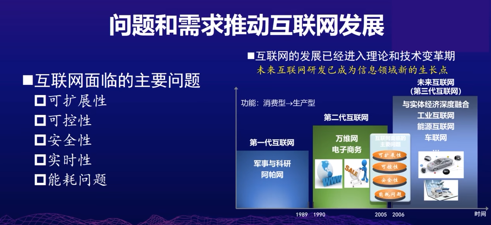
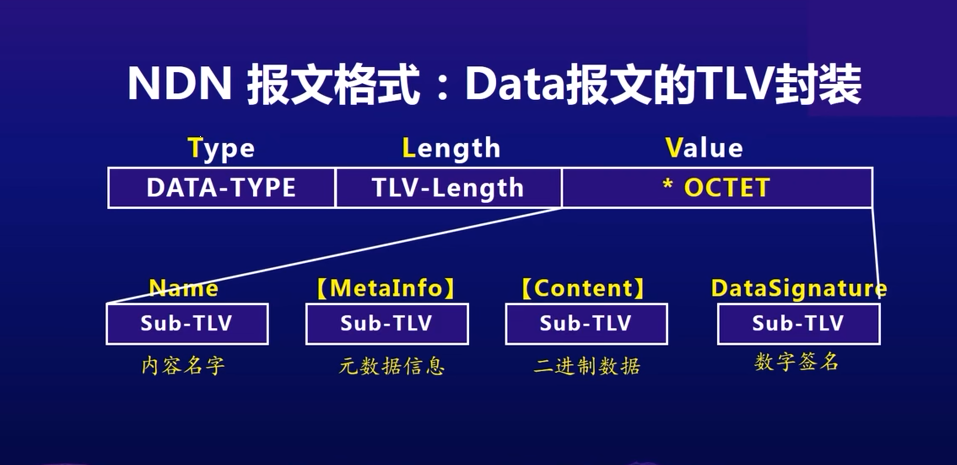

# 9.1 SDN 软件定义网络

流表

# 9.2 命名数据网络
    

    

    

    

    

    

    

    

    

    

    

    

    

    
        https://docs.named-data.net/NDN-packet-spec/0.3/

    

    

# 9.4 移动优先网络与网络实验设施
    

        加入了GUID这一层，来应对移动网络的特性
    
    

    

    

    

    网络实验设施
        

        
            https://ceni.ustc.edu.cn/login

        

